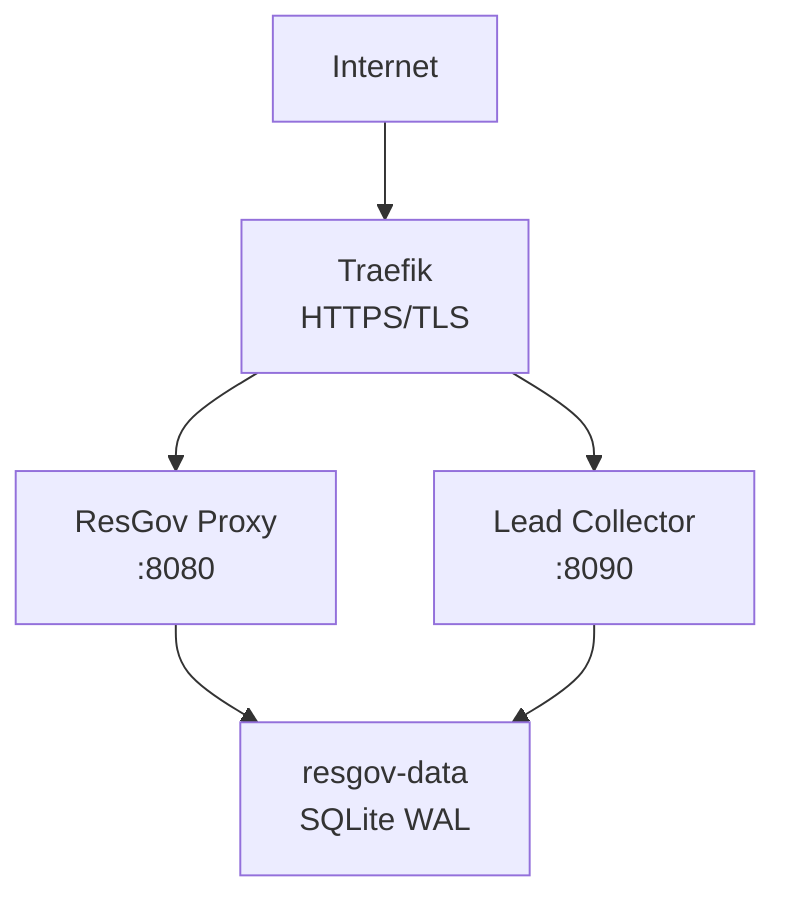

# ResGov (RGF) — Production Deployment Guide

> Deploy ResGov behind Traefik with HTTPS, persistent storage, and automated backups.

## Architecture Overview



## Prerequisites

- Linux server with Docker & Docker Compose
- Traefik reverse proxy (already running, see [Traefik Docker Deployment](traefik-docker-deployment))
- A domain pointing to your server (e.g. `api.resgov.silentops.cloud`)
- OpenRouter API key (for LLM proxy)

## Server Setup

### 1. Clone and Configure

```bash
git clone https://github.com/michael-ebering/resgov.git /opt/resgov
cd /opt/resgov
cp .env.example .env
```

Edit `.env`:

```bash
# Required
RESGOV_ADMIN_TOKEN=<generate-a-long-random-string>
RESGOV_API_KEYS=<any-initial-admin-key>:admin

# Server
RESGOV_HOST=0.0.0.0
RESGOV_PORT=8080

# Dashboard auth (set to enable, leave DASH_PASS empty to disable)
RESGOV_DASH_USER=admin
RESGOV_DASH_PASS=<dashboard-password>

# Backup
RESGOV_BACKUP_DIR=/data/backups
RESGOV_BACKUP_RETENTION=7

# Optional: webhook notifications
RESGOV_WEBHOOK_URL=<your-discord/slack-webhook-url>
RESGOV_WEBHOOK_SECRET=<hmac-secret>
```

### 2. Configure Traefik

The `docker-compose.yml` includes Traefik labels. Ensure:

1. **Traefik is running** on the same Docker network (`bridge`)
2. **DNS is set:** `dig api.resgov.silentops.cloud +short` → your server IP
3. **Let's Encrypt works** for your domain

> **IMPORTANT:** Before starting containers, verify DNS propagation. Traefik caches Let's Encrypt failures (NXDOMAIN), and a simple restart won't retry. If DNS isn't ready yet, wait.

```bash
# Verify DNS
dig api.resgov.silentops.cloud +short
# → 187.127.87.198 (your server IP)
```

### 3. Start Services

```bash
docker compose up -d
```

### 4. Verify

```bash
# Health check
curl https://api.resgov.silentops.cloud/health
# → {"status":"ok","version":"0.4.4"}

# Dashboard (if auth enabled)
# https://api.resgov.silentops.cloud/dash

# API docs
# https://api.resgov.silentops.cloud/docs
```

## Generating API Keys

Once running, generate API keys for your agents:

```bash
curl -X POST https://api.resgov.silentops.cloud/api/v1/admin/generate-key \
  -H "X-Admin-Token: <your-admin-token>" \
  -H "Content-Type: application/json" \
  -d '{"owner": "my-project", "agent_id": "hermes"}'
```

Response:

```json
{
  "api_key": "rgf_xxxxxxxxxxxxxxxx",
  "owner": "my-project",
  "agent_id": "hermes",
  "created_at": "2026-05-29T12:00:00Z"
}
```

Store this key — it won't be shown again.

## Backups

The `scripts/backup.sh` script performs atomic SQLite backups (safe for WAL mode).

### Cron Backup (Daily at 3 AM)

```bash
docker exec resgov bash -c "apt-get update && apt-get install -y cron"
docker exec resgov bash -c "echo '0 3 * * * /app/scripts/backup.sh >> /data/backup.log 2>&1' | crontab -"
```

### Manual Backup

```bash
docker exec resgov /app/scripts/backup.sh
```

Backups are stored in `/data/backups/` (mounted volume) with configurable retention (default: 7 days).

### Restore from Backup

```bash
docker compose exec resgov bash -c "cp /data/backups/resgov_20260529_030000.db /data/resgov.db"
docker compose restart resgov
```

## Monitoring

### Health Endpoint

```bash
curl https://api.resgov.silentops.cloud/health
```

### Prometheus Metrics

```bash
curl https://api.resgov.silentops.cloud/metrics
```

Integrate with your Prometheus instance:

```yaml
# prometheus.yml
scrape_configs:
  - job_name: 'resgov'
    scrape_interval: 30s
    static_configs:
      - targets: ['api.resgov.silentops.cloud:443']
    scheme: https
    metrics_path: /metrics
```

### Dashboard

The built-in dashboard at `/dash` shows:
- Active agents & usage stats
- Budget consumption per agent
- API key management
- System health

## Updating

```bash
cd /opt/resgov
docker compose down
git pull --rebase origin main
docker compose build --no-cache
docker compose up -d
```

### Zero-Downtime Update (Blue-Green)

For production environments requiring zero downtime:

```bash
# Pull new image
docker compose pull

# Start new containers alongside old
docker compose up -d --scale resgov=2

# Wait for health
sleep 10
curl -f http://localhost:8080/health || echo "NEW INSTANCE FAILED"

# Remove old container
docker compose up -d --scale resgov=1
```

## Troubleshooting

**Container won't start:**
```bash
docker compose logs resgov --tail 50
# Check .env is present and valid
# Check port 8080 not in use
```

**HTTPS not working (certificate errors):**
```bash
# Verify DNS propagation first
dig api.resgov.silentops.cloud +short

# Check Traefik logs
docker logs traefik --tail 30

# Reset if NXDOMAIN was cached
docker compose down && docker compose up -d
```

**Database locked errors:**
- SQLite WAL mode handles concurrent reads fine
- If you see "database is locked", check for stale `.db-shm` or `.db-wal` files
- Restart the container: `docker compose restart resgov`

**Budget not enforced:**
- `.rgf` auto-loads from the working directory (`/app` inside container)
- For production, bake `.rgf` into your Dockerfile or mount it as a volume:
  ```yaml
  volumes:
    - ./my-config.rgf:/app/.rgf
  ```

**Metrics endpoint empty:**
- Metrics are populated after at least one API call
- Ensure the `/metrics` path isn't blocked by Traefik middleware

## Security Hardening

1. **Always set `RESGOV_ADMIN_TOKEN`** — without it, admin endpoints are unprotected
2. **Enable dashboard auth** — set `RESGOV_DASH_PASS` in `.env`
3. **Restrict CORS** — set `RESGOV_CORS_ORIGINS` to your frontend domains in production
4. **Rotate API keys** — use the audit endpoint to track usage and revoke stale keys
5. **Use `.rgf` fail-safe** — set `fail_safe_action = "deny"` to block requests if the budget system fails
6. **Don't expose port 8080 publicly** — Traefik handles HTTPS termination; the container only needs `expose`, not `ports`
