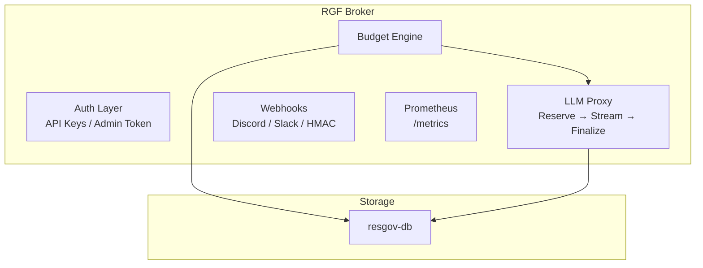

<div align="center">


<a href="https://github.com/michael-ebering/resgov/stargazers"></a>

# The Resource Governance Framework (RGF) for Multi-Agent Environments

**The missing circuit breaker between your autonomous agents and your credit card.**
_STOP letting runaway agent loops burn through your API budgets overnight._

> **Note:** This is an independent private open-source project by Michael Ebering. Not affiliated with or endorsed by any employer.

ResGov is a lightweight, ultra-low-latency proxy and governance engine. It complements MCP and A2A by adding a strict economic layer: preventing cost explosions through real-time quota enforcement, per-agent budget tracking, and stream-safe cost governance.

📡 [Live Demo](https://resgov.silentops.cloud) · [Quick Start](#-quick-start) · [Governance as Code](#-governance-as-code) · [Architecture](#-architecture) · [API](#-api-reference)

</div>

---

## ⚡ Why ResGov (RGF) Exists

### The Problem
Your agents make thousands of autonomous API calls. The moment they get stuck in a recursive loop while you sleep, they generate catastrophic API bills. Modern LLM providers offer billing alerts, but **no real-time, granular execution-level budget enforcement**.

### The Multi-Agent Stack
- **MCP** (Model Context Protocol) → Defines _how agents talk to tools_.
- **A2A** (Agent-to-Agent) → Defines _how agents delegate tasks_.
- **RGF** (Resource Governance Framework) → Defines _how agents **spend your money**_.

ResGov is the industry's first open solution for the RGF layer.

---

## 🛠️ Key Features

- **Transparent LLM Proxy:** Drop-in replacement for OpenAI/Anthropic/OpenRouter endpoints. Just flip your framework's `base_url`.
- **Atomic Pre-Commit & Finalize:** Reserves a pessimistic `max_cost` during a millisecond DB lock at stream start, streams lock-free, and refunds the difference instantly after stream-end. Zero deadlocks.
- **Governance as Code (`.rgf`):** Define limits, allowed models, and tools via a dead-simple configuration file straight inside your Git repo.
- **Non-LLM Resource Booking (`/api/v1/book`):** A unified control plane to throttle and audit paid web-scrapers, search APIs, or file operations.
- **Multi-Tenant Isolation:** Real-world ready with organization-scoping and secure row-level data isolation.
- **Predictive Budget Forecasting:** Proactively avert cost overruns with AI-powered spend predictions.

---

## 📝 Governance as Code (The `.rgf` File)

Skip complex dashboard configurations for local or single-instance setups. ResGov lets you control budgets via a simple, declarative `.rgf` (TOML) file in your project root. 

```toml
# .rgf - Resource Governance Rules

[global]
currency = "USD"
fail_safe_action = "deny" # Hard block if proxy connectivity drops

[agents.hermes]
daily_budget = 3.00
max_tokens_per_request = 4096
allowed_models = ["anthropic/claude-sonnet-4-6", "openrouter/deepseek/deepseek-v4-flash"]

[agents.research-bot]
daily_budget = 1.00
allowed_models = ["gpt-4o-mini"]
allowed_tools = ["web-scraper", "pexels_search"]
```


## 📝 Predictive Budget Forecasting

ResGov utilizes historical spend patterns to predict when an agent is likely to exhaust its budget. This gives you time to intervene *before* an overrun occurs, enabling true proactive cost management. 

Query the prediction API:
```http
GET /api/v1/agents/my-agent-01/prediction?period=daily&lookback_hours=6
```

Example Response:
```json
{
  "status": "ok",
  "message": "Prediction successful.",
  "remaining_budget": 42.15,
  "rate_usd_per_hour": 1.75,
  "prediction_timestamp": "2026-05-29T14:30:00Z",
  "remaining_time_seconds": 86400.0
}
```

---

## 🚀 Quick Start

### 1. Spin up the Broker via Docker
```bash
git clone https://github.com/michael-ebering/resgov.git
cd resgov
cp .env.example .env          # Set your RESGOV_ADMIN_TOKEN
docker compose up -d

# Core Proxy API: https://api.resgov.silentops.cloud/v1
# Dashboard:      http://localhost:8080/dash
# Health V2:      https://api.resgov.silentops.cloud/health
```

### 2. Plug it into your Framework (No Custom Code)

#### CrewAI
```python
from crewai import Agent, LLM

llm = LLM(
    model="openai/anthropic/claude-sonnet-4",
    base_url="https://api.resgov.silentops.cloud/v1", # Routes through ResGov
    api_key="your-rgf-api-key",
    extra_headers={"X-ResGov-Agent-ID": "hermes"},
)

agent = Agent(role="Analyst", llm=llm, goal="Process streams...")
```

#### LangChain
```python
from langchain_openai import ChatOpenAI

llm = ChatOpenAI(
    model="anthropic/claude-sonnet-4",
    base_url="https://api.resgov.silentops.cloud/v1",
    api_key="your-rgf-api-key",
    default_headers={"X-ResGov-Agent-ID": "hermes"},
)
```

### 🛑 Budget Denied Interception
When an agent attempts to breach its allocated .rgf budget, ResGov aborts the call immediately before it hits the upstream provider, returning a clean 403 Forbidden:
```json
{
  "error": {
    "type": "budget_exceeded",
    "message": "Daily budget exceeded. Limit: $3.00, Spent: $2.98, Required: $0.15",
    "agent_id": "hermes",
    "reason": "daily_budget_exceeded"
  }
}
```

## 📡 Governance API Reference
For non-LLM transactional jobs (e.g., custom tool executions, paid data scraping):
```http
# Book a Non-LLM resource allocation
POST /api/v1/book
{
    "agent_id": "research-bot",
    "resource_type": "api_call",
    "action": "pexels_search",
    "cost": 0.05,
    "metadata": {"query": "infrastructure"}
}

# Admin Operations (Requires X-Admin-Token)
POST   /api/v1/admin/reset-daily          → Reset all daily allocations
POST   /api/v1/admin/generate-key         → Issue a new secure API Key
POST   /api/v1/admin/price-cache/refresh  → Refresh model price cache from OpenRouter
GET    /api/v1/audit                      → Paginated system audit trail
GET    /metrics                           → Native Prometheus metrics scraper
```

## 🏗️ Architecture & Production Design



*   **SQLite WAL Core:** Leverages concurrent reads and serialized fast-writes. Perfect for zero-config single-instance environments and edge infrastructure.
*   **Pessimistic Stream Reservation:** Solves concurrency double-spending by checking and deducting potential `max_cost` instantly. The heavy streaming network phase runs completely lock-free.
*   **Crash Recovery Guard:** Stuck reservations automatically decay and revert after 5 minutes if an agent execution script crashes mid-stream.

## 🗺️ Roadmap

**Documentation:**
- [Interactive API Docs (Swagger)](https://api.resgov.silentops.cloud/docs) · [ReDoc](https://api.resgov.silentops.cloud/redoc)
- [ONBOARDING.md](ONBOARDING.md) — Developer quick-start guide
- [DEPLOYMENT.md](DEPLOYMENT.md) — Production deployment guide (Traefik, HTTPS, backups)
- [docs/adr.md](docs/adr.md) — Architecture Decision Records
- [docs/rgf-examples.md](docs/rgf-examples.md) — `.rgf` configuration examples for 7 scenarios

### v0.5 (Next)
*   [ ] Redis/Dragonfly Backend for horizontal multi-instance proxy scaling.
*   [ ] Out-of-the-box Slack & Discord alert layout engines.
*   [x] Predictive budget forecasting (spend-velocity heuristics).

### v0.6
*   [ ] Open Policy Agent (OPA) declarative engine integration.
*   [ ] Official Terraform Provider & Kubernetes Helm Charts.

## 📄 License
This project is licensed under the Business Source License 1.1 (BSL-1.1).
*   Free forever for personal use, testing, and internal non-commercial setups.
*   Free forever for production scale in companies making < $1M ARR.
*   Change Date: Automatically transitions into an open-source Apache 2.0 License on May 31, 2029.

<div align="center">
<sub>Built by SilentOps with strict focus on correctness, speed, and cost guardrails.</sub>
⭐ Star this repo if it saved your API budget.
</div>