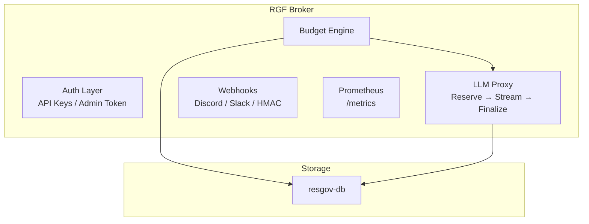

<div align="center">

[Python shields.io badges — same as EN README]

# Das Resource Governance Framework (RGF) für Multi-Agenten-Umgebungen

**Die fehlende Sicherung zwischen deinen autonomen Agenten und deiner Kreditkarte.**
_LASS runaway-Agenten-Schleifen nicht über Nacht dein API-Budget vernichten._

> **Hinweis:** Dies ist ein unabhängiges privates Open-Source-Projekt von Michael Ebering.

ResGov ist eine leichtgewichtige Ultra-Latenz-Proxy- und Governance-Engine. Es ergänzt MCP und A2A um eine strenge ökonomische Schicht.

📡 [Live-Demo](https://resgov.silentops.cloud) · [Quick Start](#-quick-start) · [Governance als Code](#-governance-als-code-die-rgf-datei) · [Architektur](#-architektur--produktionsdesign) · [API-Referenz](#-governance-api-reference) · [Dokumentation](docs/)

</div>

---

## ⚡ Warum ResGov (RGF) existiert

### Das Problem
Deine Agenten tausende autonome API-Aufrufe. In dem Moment, in dem sie in einer rekursiven Schleifen stecken, während du schläfst, generieren sie katastrophale API-Rechnungen. Moderne LLM-Anbieter bieten Billing-Alerts, aber **keine granulare Echtzeit-Budget-Durchsetzung auf Ausführungsebene**.

### Der Multi-Agenten-Stack
- **MCP** → Definiert _wie Agenten mit Tools sprechen_.
- **A2A** → Definiert _wie Agenten Aufgaben delegieren_.
- **RGF** → Definiert _wie Agenten **dein Geld ausgeben**_.

ResGov ist die erste Open-Source-Lösung der Industrie für die RGF-Schicht.

---

## 🛠️ Kernfunktionen

- **Transparenter LLM-Proxy:** Drop-in-Ersatz für OpenAI/Anthropic/OpenRouter. Einfach `base_url` ändern.
- **Atomar Pre-Commit & Finalize:** Reserviert pessimistische `max_cost` beim Streamstart (Millisekunden-Lock), streamt lockfree, erstattet Differenz nach Streamende.
- **Governance als Code (`.rgf`):** Budgets, Modelle und Tools über eine TOML-Datei im Git-Repo definieren.
- **Nicht-LLM-Reservierung:** Einheitliche Kontrollebene für Web-Scraper, Search-APIs etc. über `POST /api/v1/book`.
- **Multi-Tenant-Isolierung:** Organisation-Scoped mit sicherer Zeilen-Datenisolierung.
- **Prädiktive Budgetvorhersage:** Kostenüberschreitungen proaktiv verhindern durch KI-gestützte Ausgabenvorhersagen.

---

## 📝 Governance als Code (Die `.rgf`-Datei)

```toml
# .rgf - Resource Governance Rules
[global]
currency = "USD"
fail_safe_action = "deny"

[agents.hermes]
daily_budget = 3.00
max_tokens_per_request = 4096
allowed_models = [
    "openrouter/anthropic/claude-sonnet-4-6",
    "openrouter/deepseek/deepseek-v4-flash"
]

[agents.research-bot]
daily_budget = 1.00
allowed_models = ["openrouter/openai/gpt-5-4-mini"]
allowed_tools = ["web-scraper", "pexels_search"]
```

---

## 📝 Prädiktive Budgetvorhersage

```http
GET /api/v1/agents/my-agent-01/prediction?period=daily&lookback_hours=6
```

```json
{
  "status": "ok",
  "remaining_budget": 42.15,
  "rate_usd_per_hour": 1.75,
  "remaining_time_seconds": 86400.0
}
```

---

## 🚀 Quick Start

### 1. Broker via Docker
```bash
git clone https://github.com/michael-ebering/resgov.git
cd resgov
cp .env.example .env
docker compose up -d
```

### 2. Framework-Integration

#### CrewAI
```python
from crewai import Agent, LLM
llm = LLM(
    model="openai/anthropic/claude-sonnet-4-6",
    base_url="https://api.resgov.silentops.cloud/v1",
    api_key="dein-rgf-api-key",
    extra_headers={"X-ResGov-Agent-ID": "hermes"},
)
```

#### LangChain
```python
from langchain_openai import ChatOpenAI
llm = ChatOpenAI(
    model="anthropic/claude-sonnet-4-6",
    base_url="https://api.resgov.silentops.cloud/v1",
    api_key="dein-rgf-api-key",
    default_headers={"X-ResGov-Agent-ID": "hermes"},
)
```

### 🛑 Budget-verweigert-Interzeption
```json
{
  "error": {
    "type": "budget_exceeded",
    "message": "Tagesbudget überschritten. Limit: $3.00, Ausgegeben: $2.98",
    "agent_id": "hermes"
  }
}
```

## 📡 Governance API-Referenz

**Interaktive API-Doku:** `GET /docs` (Swagger UI) · `GET /redoc` (ReDoc)

```http
POST /api/v1/book
POST /api/v1/admin/reset-daily
POST /api/v1/admin/generate-key
GET  /api/v1/audit
GET  /metrics
```

## 🏗️ Architektur & Produktionsdesign



- **SQLite-WAL-Core:** Gleichzeitige Lesevorgänge, serialisierte Schnellschreibvorgänge.
- **Pessimistische Stream-Reservation:** Verhindert Concurrency-Doppelabzug. Streaming läuft lockfrei.
- **Crash-Recovery-Guard:** Hängende Reservationen verfallen nach 5 Minuten automatisch.

## 🗺️ Roadmap

- [Developer-Onboarding](ONBOARDING.md) · [Deployment-Guide](DEPLOYMENT.md) · [.rgf-Beispiele](docs/rgf-examples.md)

### v0.5
- [ ] Redis/Backend für horizontale Multi-Instance-Skalierung
- [ ] Slack & Discord Alert-Layout-Engines
- [x] Prädiktive Budgetvorhersage

### v0.6
- [ ] Open Policy Agent (OPA) Integration
- [ ] Terraform Provider & Kubernetes Helm Charts

### v1.0
- [ ] Multi-tenant Managed Cloud SaaS
- [ ] Enterprise SSO / SAML & RBAC

## 📄 Lizenz
Business Source License 1.1 (BSL-1.1). Kostenlos für persönliche Nutzung und Unternehmen mit < $1M ARR. Wechsel zu Apache 2.0 am 31. Mai 2029.

<div align="center">
<sub>Gebaut von SilentOps mit Fokus auf Korrektheit, Geschwindigkeit und Kostensicherungen.</sub>
⭐ Stern dieses Repo, wenn es dein API-Budget gerettet hat.
</div>
